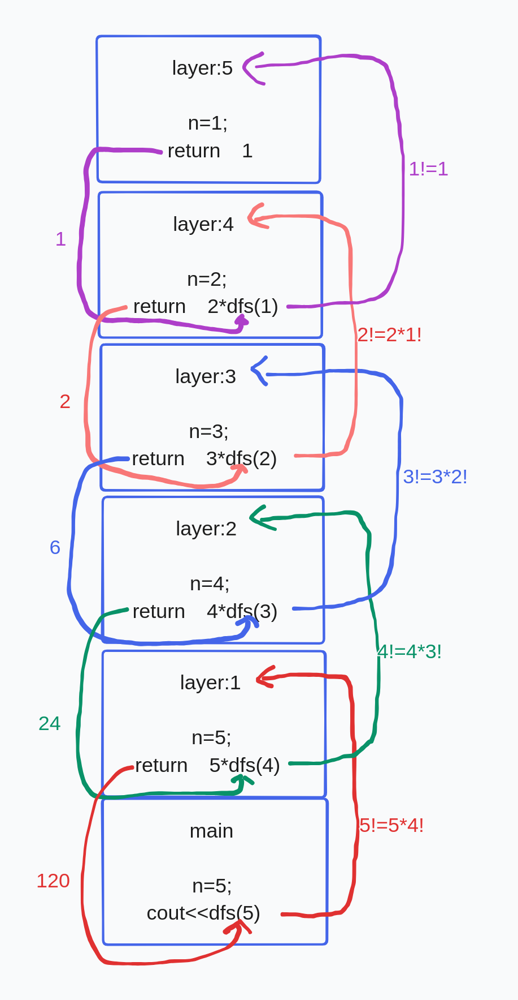

# 从两个程序体会递归的工作流程

### 程序一

    #include<iostream>
    using namespace std;

    int n,mul=1;

    void dfs(int n){

        for(int i=n;i>=1;--i)
            mul*=i;

    }

    int main(){

        cin>>n;
        dfs(n);
        cout<<mul;
        return 0;

    }

### 程序二

    #include<iostream>
    using namespace std;

    int n,mul=1;

    void dfs(int n){
        if(n==1)
            return ; 
    
        mul*=n;
        dfs(n-1);
    }

    int main(){

        cin>>n;
        dfs(n);
        cout<<mul;
        
        return 0;

    }
以上两段代码分别实现的功能是什么呢？其实这两段代码实现的功能是一样的。第一段代码不做详解。我们看一看第二段代码运行过程的示意图。

再来看一段代码：

 ### 程序三

    #include<iostream>
    using namespace std;

    int n;

    int dfs(int n){
        if(n==1)
            return 1; 
        
        return n*dfs(n-1);
    }

    int main(){

        cin>>n;
        cout<<dfs(n);
        
        return 0;

    }

这个程序运行时内存中存储的过程如下：

程序三其实就是求n!，我们可以将n!转化为n*(n-1)！，即：n!=n*(n-1)!；便可以此转化(n-1)!=(n-1)*(n-1)!...2!=2*1!，最后返回1!=1；再如图所示依次返回2!=2*1=2；3!=3*2!=6；4!=4*3!=24;5!=5*4!=120。