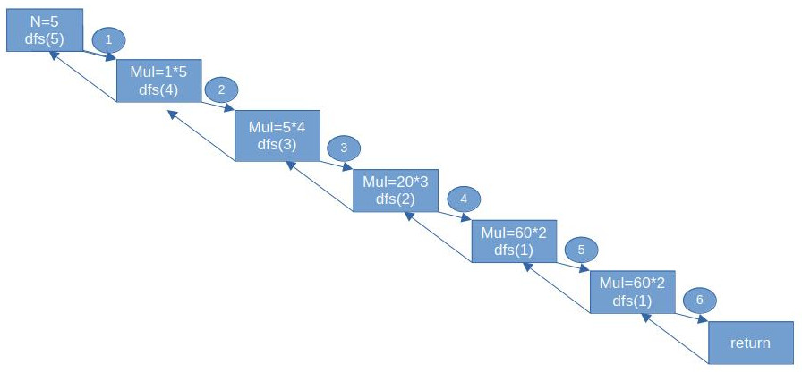

# 从两个程序体会递归的工作流程
### 程序一

    #include<iostream>
    using namespace std;

    int n,mul=1;

    void dfs(int n){

        for(int i=n;i>=1;--i)
            mul*=i;

    }

    int main(){

        cin>>n;
        dfs(n);
        cout<<mul;
        return 0;

    }

### 程序二

    #include<iostream>
    using namespace std;

    int n,mul=1;

    void dfs(int n){
        if(n==1)
            return ; 
    
        mul*=n;
        dfs(n-1);
    }

    int main(){

        cin>>n;
        dfs(n);
        cout<<mul;
        
        return 0;

    }
以上两段代码分别实现的功能是什么呢？其实这两段代码实现的功能是一样的。第一段代码不做详解。我们看一看第二段代码运行过程的示意图。

